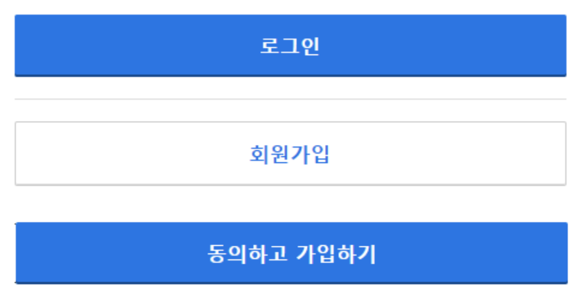
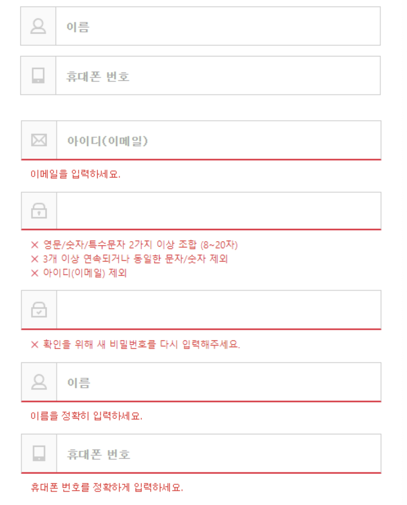
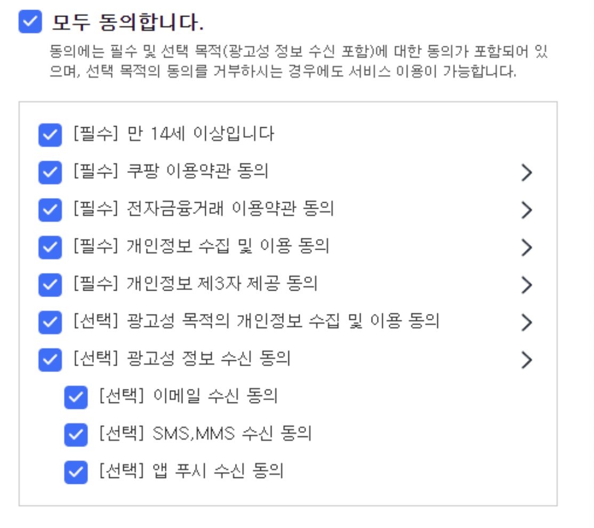

## NUMBLE - 가장 실무에 가까운 쿠팡 클론코딩 2회차


[챌린지 페이지](https://www.numble.it/84b74183-c72e-4502-91c9-e41fbf0aa7aa)

이번 챌린지에서는 쿠팡 서비스에서 사용되는 컴포넌트들을 만들어볼게요!

총 네 개의 컴포넌트를 설계하며, 실무에서처럼 다양한 유즈케이스에 탄력적으로 대응할 수 있는 구조에 대해서 고민해보아요.

만든 컴포넌트들은 Storybook을 사용해 누구나 확인할 수 있도록 배포할거에요.

<br><br>

---

## button



쿠팡서비스에서 Button 컴포넌트가 활용되는 방식은 아래와 같습니다.

1. 일반적인 button element
2. form의 submit
3. a tag를 이용한 페이지 라우팅 (next/link 사용)

위 유즈케이스들을 대응하기 위해 Button 컴포넌트가 어떻게 대응해야할지 아래와 같은 pseudo code를 작성하며 고민해보아요.

```jsx
// 일반적인 button element
const addToCart = () => {};

return (
	<Button
		// 어떤 prop들을 어떻게 활용하면 좋을지 작성해보세요
	/>
);
```

<br><br>

## input



1. react-hook-form의 register를 사용할 수 있어야 한다.
2. focus시 border-bottom이 파란색으로, error시 빨간색으로 바뀐다.
3. 좌측에 icon이 표시된다.
4. invalid한 값 입력 시 적절한 에러 메세지를 보여준다.
5. 필요 시 autoComplete도 사용할 수 있다. (마지막 스크린샷 참고)
    
    이 요구사항은 어려우면 Pass하셔도 좋습니다 😃


<br><br>


#### Input도 마찬가지로 pseudo 코드를 작성하며 고민해보아요!

```jsx
import { useForm } from "react-hook-form"

import { Input } from "../components/common"

const Login: NextPage = () => {
  const { register } = useForm();

  return (
		<Input
			{...register("email")}
			// 어떤 prop이 추가로 필요할까요?
		/>
	)
}
```


<br><br>


## Checkbox, CheckBoxGroup



<br><br>

## 구현한 컴포넌트들을 활용해 LoginPage, SignupPage를 구현해보아요!


<br><br>

### 마무리 - Storybook을 설치하고 Chromatic으로 배포하기

---

완성된 Button, Input, Check 컴포넌트의 스토리 파일을 작성, (stories 파일은 컴포넌트와 같은 경로에 배치하는 것을 추천합니다.)

Chromatic에 스토리북을 배포하기


https://thoughtful-arch-8c2.notion.site/964d10e72cb4418d8cc49543a4b9ad41